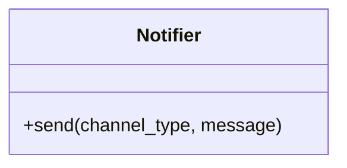
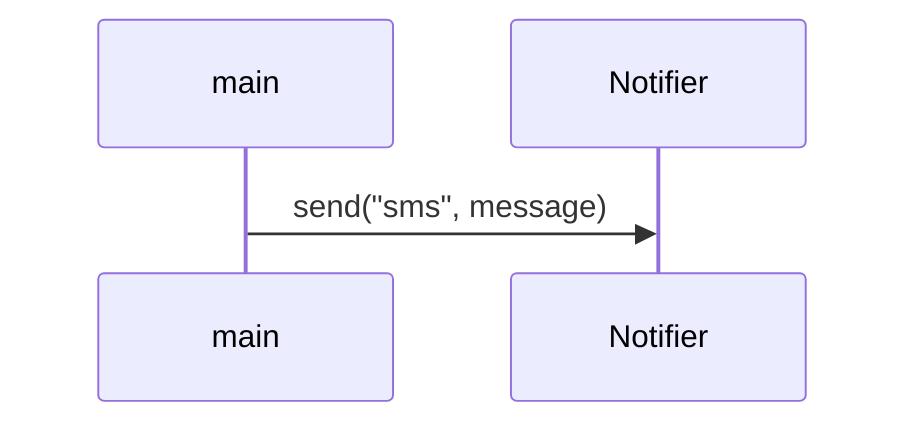
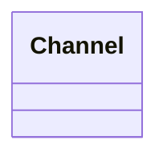

# Фамилия Имя

Скопируйте файл в `diagrams/Фамилия.md`. Шпаргалка по синтаксису: `mermaid.md`.

## 1. Диаграмма классов: как есть

## 2. Последовательность: отправка SMS с повтором

## 3. Диаграмма классов: после рефакторинга

Только та часть, которую вы меняли.

## 4. Где паттерн окупился, а где был бы лишним

(трек «опытный»)
